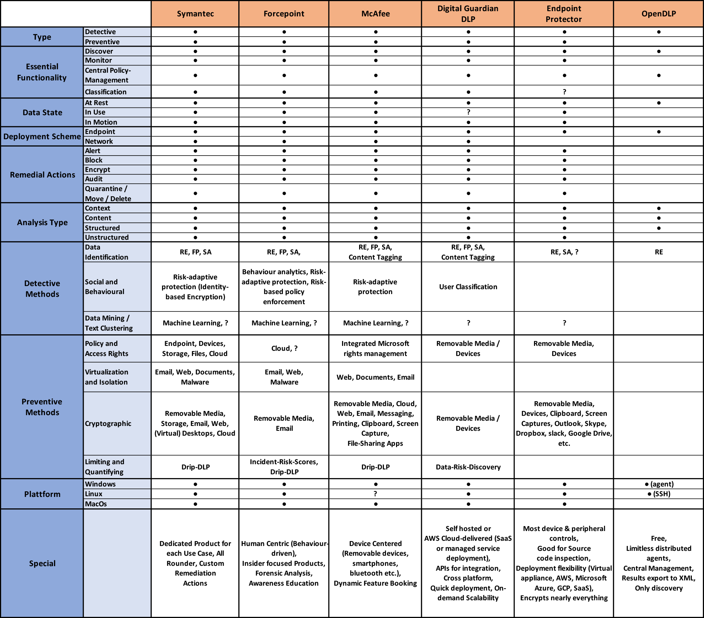

# DLP-Software Comparison
The following table presents a collection of currently popular data leakage detection and prevention (DLP) software and its features. The table was a by-product of a paper I had to write for the course "Sicherheit, Privatsphäre und Vertrauen im Netz" in the degree course "Medieninformatik Master" at TH-Köln, in which I had to write about DLP as a whole (from basics to use cases). The products appearing in this list were chosen according to the [Gartner DLP market review 2021](https://www.gartner.com/reviews/market/enterprise-data-loss-prevention). The open source software OpenDLP was added to provide a comparison to free, non enterprise solutions (of which there are very few in this category). Presented features were extracted from publicly available contents of the corresponding provider web page and therefor do not claim to be complete or fully correct. Everything marked with a questionmark has a high chance to be part of the product, but hasnt been mentioned explicitly on the web page.

